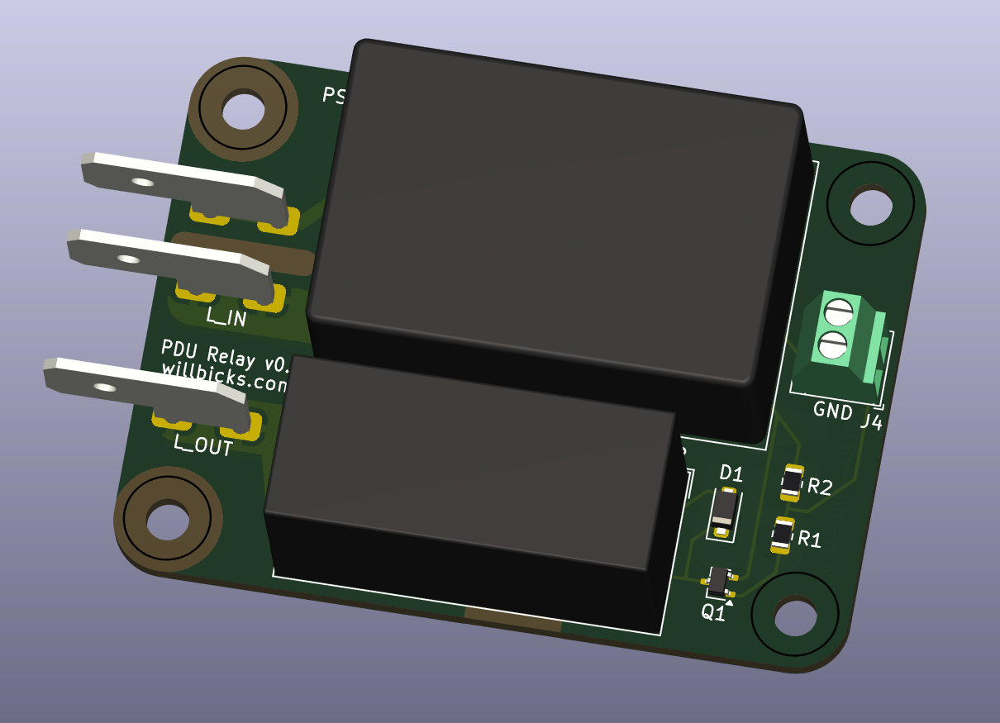
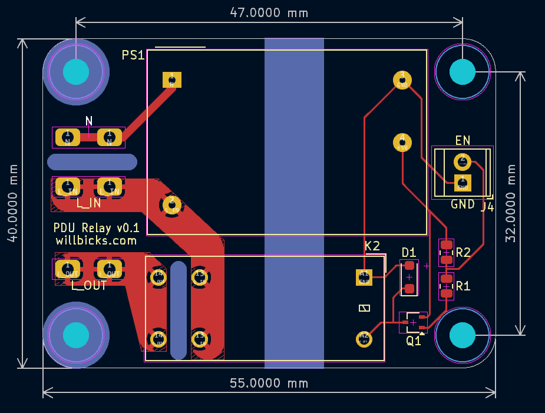

# PDU Relay Module

This PDU relay is intended to be retrofit into a standard 19" rack mount PDU, and allows for any subsection of the outputs to be turned on or off based on an external isolated logic input. It provides a relay that energizes the live rail of the PDU only when the logic input is held low, and de-energizes them otherwise. This makes the logic input suitable for any dry contact or open collector output that can sink a few milliamps of current.

In my case, I am using this module in a JG JR PDU to switch on audio amplifiers when a Biamp Tesira DSP detects audio input, and then automatically switch them back off after a period of inactivity to conserve power.

## Specifications

### Electrical Specifications

This power supply and relay in this module are rated to support:

- 120 - 240 VAC input at 50-60Hz
- 16 A AC load switching (resistive)

The AC input / output terminals are 0.25" x 0.032" spade terminals.

The logic input is a 2.54mm pitch 2-pin screw terminal. Pin 1 is an AC isolated ground, while pin 2 is the active low logic input. To close the relay, pin 2 should be pulled low relative to the ground terminal. Total current draw from the logic input is less than 1 mA.

### Mechanical Specifications

The assembled module is 55 mm x 45 mm x ~20mm. It has 4 holes for M3 screws as shown below.

## Source Usage

This repository contains a KiCAD 8.0.0 project with the schematic and PCB layout for the PDU relay module. Gerber files, a BOM, and PDFs of the schematic and PCB layout are available in the [releases section of the repository](https://www.github.com/willbicks/pdu-relay/releases).

## Electrical Safety

This unit is intended for reference and evaluation and has not been tested nor certified by any safety agency. It is the responsibility of the user to ensure that the final product meets all applicable safety standards and regulations.

In addition to ensuring that this design meets all applicable safety standards and regulations, the following basic precautions should be taken when installing and using this module:

- The module should be securely mounted in a suitable metallic, grounded enclosure.
- The module should be installed downstream of a suitable overcurrent protection device rated for no more than 16 A.
- The switched terminals should be connected to the live rail of the PDU, and the PDU should have an appropriately polarized plug.
- Connections to and from the module should be made with suitable wire and connectors rated for the intended current and voltage, and which are insulated from accidental electrical contact.

## License

Copyright Will Bicks 2024.

This source describes Open Hardware and is licensed under the CERN-OHLW v2
You may redistribute and modify this documentation and make products
using it under the terms of the CERN-OHL-W v2 (https:/cern.ch/cern-ohl).

This documentation is distributed WITHOUT ANY EXPRESS OR IMPLIED
WARRANTY, INCLUDING OF MERCHANTABILITY, SATISFACTORY QUALITY
AND FITNESS FOR A PARTICULAR PURPOSE. Please see the CERN-OHL-W v2
for applicable conditions.

Source location: https://www.github.com/willbicks/pdu-relay
